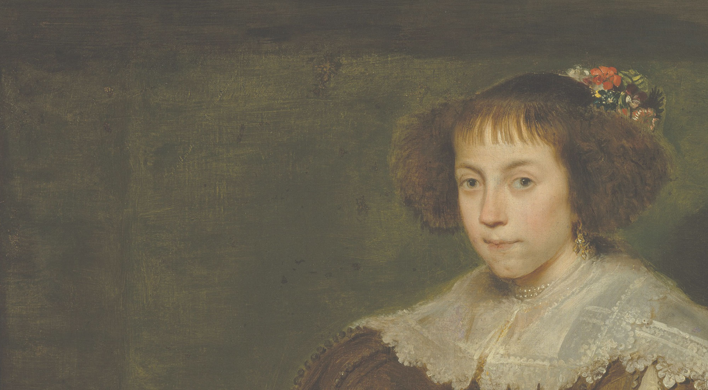

# Cleaning the Cornelia Dataset

> This repository and the code it contains was written by Lara Peeters, Wangzhi Xi and Eren Janberk Genç as part of the requirements for completing the "Introduction to Digital Humanities" class.

## What is this repository about?

## How do i reproduce this dataset?

## Repository structure